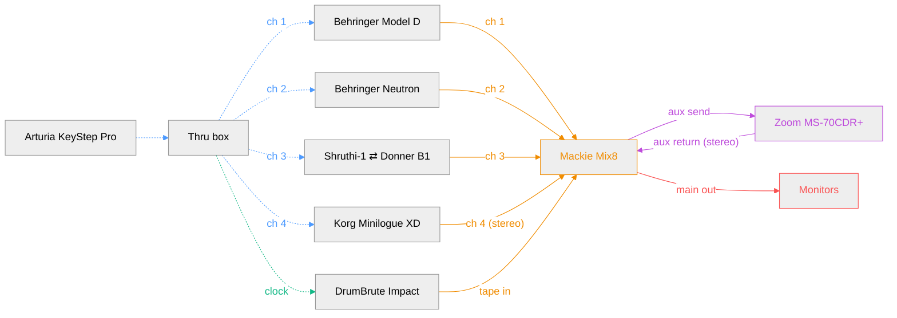

```mermaid
---
config:
  theme: neutral
---
flowchart LR
    %% ----- One color per connection group -----
    classDef midi stroke:#4c9aff,color:#4c9aff
    classDef clock stroke:#12b886,color:#12b886
    classDef mixer stroke:#f08c00,color:#f08c00
    classDef fx stroke:#be4bdb,color:#be4bdb
    classDef monitoring stroke:#fa5252,color:#fa5252

    %% ===== MIDI control =====
    KSP["Arturia KeyStep Pro"]
    SPLIT["Thru box"]

    %% ===== Synths =====
    MODELD["Behringer Model D"]
    NEUTRON["Behringer Neutron"]
    SWAP["Shruthi-1 ⇄ Donner B1"]
    XD["Korg Minilogue XD"]
    DBI["DrumBrute Impact"]

    %% ===== Mixer / send  =====
    MIX["Mackie Mix8"]:::mixer
    ZOOM["Zoom MS-70CDR+"]:::fx
    MON["Monitors"]:::monitoring

    %% ----- MIDI links -----
    KSP midi0@-.-> SPLIT
    SPLIT midi1@-. "ch 1" .-> MODELD
    SPLIT midi2@-. "ch 2" .-> NEUTRON
    SPLIT midi3@-. "ch 3" .-> SWAP
    SPLIT midi4@-. "ch 4" .-> XD
    class midi0,midi1,midi2,midi3,midi4 midi

    SPLIT clk@-. "clock" .-> DBI
    class clk clock

    %% ----- Audio links -----
    MODELD audio1@-- "ch 1" --> MIX
    NEUTRON audio2@-- "ch 2" --> MIX
    SWAP audio3@-- "ch 3" --> MIX
    XD audio4@-- "ch 4 (stereo)" --> MIX
    DBI audio5@-- "tape in" --> MIX
    class audio1,audio2,audio3,audio4,audio5 mixer

    MIX fxSend@-- "aux send" --> ZOOM
    ZOOM fxReturn@-- "aux return (stereo)" --> MIX
    class fxSend,fxReturn fx

    MIX out@-- "main out" --> MON
    class out monitoring
```

**Legend**

- MIDI: dotted arrow
- audio: solid arrow
