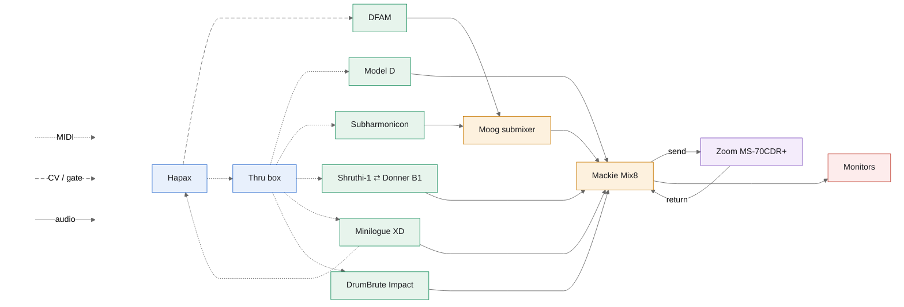

|             | Model D | Subharmonicon     | Shruthi-1 ⇄ Donner B1 | Minilogue XD | DFAM                | DrumBrute Impact |
| ----------- | ------- | ----------------- | --------------------- | ------------ | ------------------- | ---------------- |
| Hapax track | 1       | 2                 | 3                     | 4            | 5                   | 10               |
| Thru out    | 1       | 2                 | 3                     | 4            | —                   | 5                |
| MIDI ch     | 1       | 2                 | 3                     | 4            | —                   | 10               |
| CV / gate   | —       | —                 | —                     | —            | gate 1 → ADV/CLOCK  | —                |
| Mixer ch    | 1       | 2 (Moog submixer) | 3                     | 4 (stereo)   | 2 (Moog submixer)   | tape in          |
