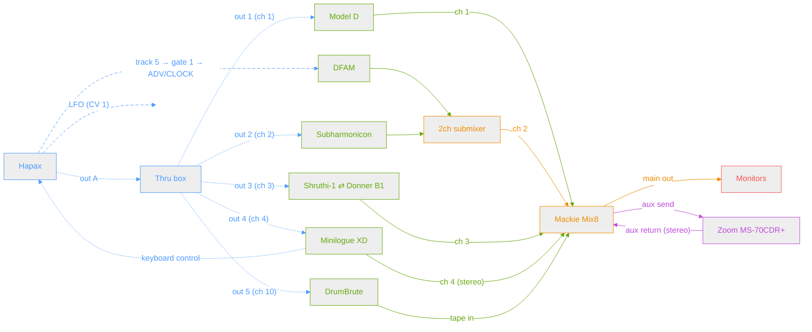

```mermaid
---
config:
  theme: neutral
---
flowchart LR
    %% ----- One color per logical section; line style = signal type -----
    classDef sequencer stroke:#4c9aff,color:#4c9aff
    classDef sequencerCV stroke:#4c9aff,color:#4c9aff,stroke-dasharray: 6 4
    classDef synths stroke:#66a80f,color:#66a80f
    classDef synthsCV stroke:#66a80f,color:#66a80f,stroke-dasharray: 6 4
    classDef mixer stroke:#f08c00,color:#f08c00
    classDef fx stroke:#be4bdb,color:#be4bdb
    classDef monitoring stroke:#fa5252,color:#fa5252

    %% ===== Sequencer brain =====
    HAPAX["Hapax"]:::sequencer
    SPLIT["Thru box"]:::sequencer
    SPARECV[" "]
    style SPARECV fill:none,stroke:none

    %% ===== Synths =====
    MODELD["Model D"]:::synths
    SUBH["Subharmonicon"]:::synths
    SWAP["Shruthi-1 ⇄ Donner B1"]:::synths
    XD["Minilogue XD"]:::synths
    DBI["DrumBrute"]:::synths
    DFAM["DFAM"]:::synths

    %% ===== Mixer / send  =====
    SUBMIX["2ch submixer"]:::mixer
    MIX["Mackie Mix8"]:::mixer
    MON["Monitors"]:::monitoring
    ZOOM["Zoom MS-70CDR+"]:::fx

    %% ----- MIDI links (dotted) -----
    HAPAX midi0@-. "out A" .-> SPLIT
    SPLIT midi1@-. "out 1 (ch 1)" .-> MODELD
    SPLIT midi5@-. "out 2 (ch 2)" .-> SUBH
    SPLIT midi3@-. "out 3 (ch 3)" .-> SWAP
    SPLIT midi4@-. "out 4 (ch 4)" .-> XD
    SPLIT midi2@-. "out 5 (ch 10)" .-> DBI
    XD midi6@-. "keyboard control" .-> HAPAX
    class midi0,midi1,midi2,midi3,midi4,midi5,midi6 sequencer

    %% ----- CV/Gate/Clock links (dashed) -----
    HAPAX cv1@-- "LFO (CV 1)" --> SPARECV
    class cv1 sequencerCV

    HAPAX clk1@-- "track 5 → gate 1 → ADV/CLOCK" --> DFAM
    class clk1 sequencerCV

    %% ----- Audio links (solid) -----
    %% (~~~ invisible links keep the six synths column-aligned despite
    %% DFAM/Subharmonicon reaching the mixer via the submixer)
    MODELD ~~~ SUBMIX
    DFAM audio1@--> SUBMIX
    MODELD audio3@-- "ch 1" --> MIX
    SUBH audio2@--> SUBMIX
    SUBMIX audio4@-- "ch 2" --> MIX
    SWAP audio5@-- "ch 3" --> MIX
    XD audio6@-- "ch 4 (stereo)" --> MIX
    DBI audio7@-- "tape in" --> MIX
    SWAP ~~~ SUBMIX
    XD ~~~ SUBMIX
    DBI ~~~ SUBMIX
    class audio1,audio2,audio3,audio5,audio6,audio7 synths
    class audio4 mixer

    MIX out@-- "main out" --> MON
    class out mixer

    MIX fxSend@-- "aux send" --> ZOOM
    ZOOM fxReturn@-- "aux return (stereo)" --> MIX
    class fxSend,fxReturn fx
```

**Legend**

Section:
- Sequencer: blue
- Synths: green
- Mixer: orange
- FX: purple
- Monitoring: red

Signal:
- MIDI: dotted
- CV/Gate/Clock: dashed
- Audio: solid
