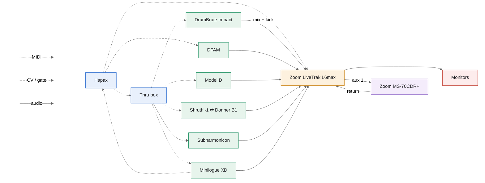

## Track / channel map

Hapax track, MIDI channel and L6max strip are the same number for every
instrument. The thru box out number is *not* aligned — it repeats every
channel to every output, so which physical port a synth sits on is
arbitrary and the existing cabling is kept.

|               | DrumBrute Impact | DFAM               | Model D | Shruthi-1 ⇄ Donner B1 | Subharmonicon | Minilogue XD | DrumBrute kick |
| ------------- | ---------------- | ------------------ | ------- | --------------------- | ------------- | ------------ | -------------- |
| Hapax track   | 1                | 2                  | 3       | 4                     | 5             | 6            | 1              |
| MIDI ch       | 1                | — (no MIDI)        | 3       | 4                     | 5             | 6            | 1              |
| Thru box out  | 5                | —                  | 1       | 3                     | 2             | 4            | 5              |
| CV / gate     | —                | gate 1 → ADV/CLOCK | —       | —                     | —             | —            | —              |
| L6max strip   | 1                | 2                  | 3       | 4                     | 5             | 6            | 7              |
| Audio out     | mono mix         | mono               | mono    | mono                  | mono          | stereo       | mono           |

DFAM keeps track 2 even though it has no MIDI channel — it is driven from
Hapax gate 1, and holding the slot keeps track number and strip number
aligned for everything below it.

## L6max strips

Eight strips: 1–4 are mono XLR/TRS combo inputs (dual A/D, 32-bit float,
Hi-Z available on 1–2 — leave it off for synths), 5–8 are stereo line
inputs with −20 dB pads. All eight are in use.

| Strip | Source                | Notes                                        |
| ----- | --------------------- | -------------------------------------------- |
| 1     | DrumBrute Mix Out     | mono; kick is patched out, so not in this mix |
| 2     | DFAM                  | mono; hottest source, watch the gain          |
| 3     | Model D               | mono                                          |
| 4     | Shruthi-1 ⇄ Donner B1 | mono                                          |
| 5     | Subharmonicon         | mono into the L jack of a stereo strip        |
| 6     | Minilogue XD          | stereo — the only stereo instrument           |
| 7     | DrumBrute Kick Out    | mono into the L jack of a stereo strip        |
| 8     | Zoom MS-70CDR+ return | stereo; set its aux 1 send to zero            |

Aux send 1 (post-fader) feeds the MS-70CDR+, which returns on strip 8.
The L6max also has six onboard send effects, so the pedal loop can be
dropped later if strip 8 is needed for something else.

Hapax out B → L6max MIDI in: clock to start with, sample pad triggers and
whatever else later. Both ends are 3.5mm TRS — confirm the L6max is
Type A like Hapax, or the link will be silent.

The Mackie Mix8 and the Moog submixer are out of the chain — the L6max
replaces both. The DrumBrute no longer goes into a Tape In, and DFAM and
Subharmonicon each get their own strip.
