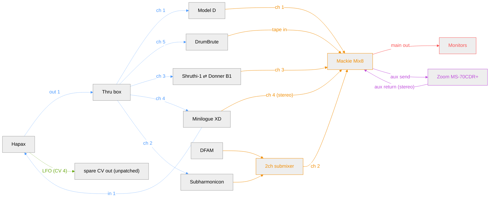

**Legend**

- MIDI (blue): dotted arrow
- CV (green): dotted arrow
- Audio/mixer (orange): solid arrow
- FX loop (purple): solid arrow
- Monitoring (red): solid arrow

## Hapax track map

Hapax has 16 tracks (any mix of MIDI or CV/Gate) and 4 physical CV/Gate pairs. Pair 4's CV (CV 4) is reserved for the spare LFO out; pairs 1-3 are fully free. Proposed assignment:

| Track | Type | Destination                            | Channel / CV pair    |
|-------|------|-----------------------------------------|------------------------|
| 1     | MIDI | Model D                                  | ch 1 (via Thru box)    |
| 2     | MIDI | Subharmonicon (transpose + clock)         | ch 2 (via Thru box)    |
| 3     | MIDI | Shruthi-1 ⇄ Donner B1 (swap)              | ch 3 (via Thru box)    |
| 4     | MIDI | Minilogue XD                             | ch 4 (via Thru box)    |
| 5     | MIDI | DrumBrute                                | ch 5 (via Thru box)    |
| 6–16  | —    | free                                     | —                       |

Notes:
- Subharmonicon has no CV/Gate connection — its MIDI in shares ch 2 with the other synths, but incoming MIDI only transposes its own onboard 4-step/polyrhythmic sequencer and syncs its internal clock, rather than dictating notes 1:1 like CV+Gate would.
- Subharmonicon relays clock to DFAM (not drawn above — a direct arrow between them would force the two into different columns): its SEQ CLK output tracks its internal clock, giving DFAM's Clock In a tempo-locked signal with no cable needed from Hapax.
- DFAM's pitch CV+Gate is deferred: it currently runs its own onboard 8-step sequencer, only clock-synced via Subharmonicon.
