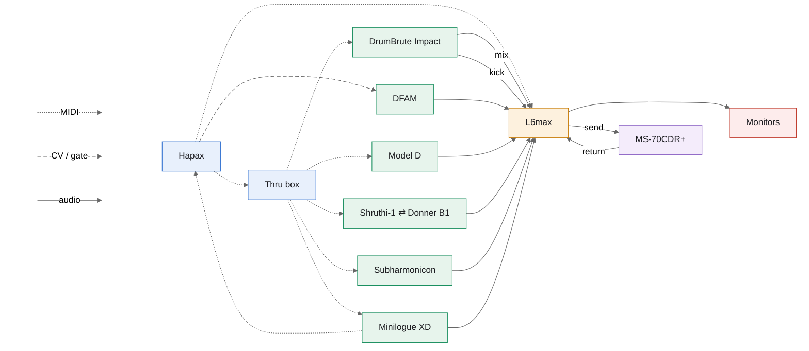

|             | DrumBrute Impact | DFAM               | Model D | Shruthi-1 ⇄ Donner B1 | Subharmonicon | Minilogue XD | DrumBrute kick | MS-70CDR+ |
| ----------- | ---------------- | ------------------ | ------- | --------------------- | ------------- | ------------ | -------------- | --------- |
| Hapax track | 1                | 2                  | 3       | 4                     | 5             | 6            | 1              |           |
| Thru out    | 5                |                    | 1       | 2                     | 3             | 4            | 5              |           |
| MIDI ch     | 1                |                    | 3       | 4                     | 5             | 6            | 1              |           |
| CV / gate   |                  | gate 1 → ADV/CLOCK |         |                       |               |              |                |           |
| L6max strip | 1 (mono mix)     | 2                  | 3       | 4                     | 5             | 6 (stereo)   | 7              | 8 ← aux 1 |
