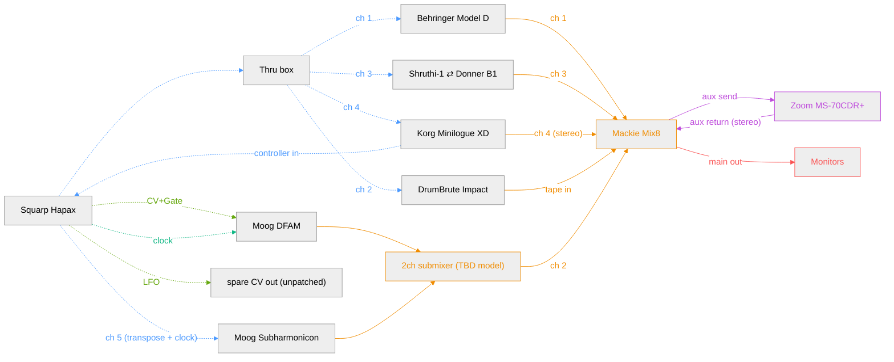

**Legend**

- MIDI (blue): dotted arrow
- Clock/sync (teal): dotted arrow
- CV (green): dotted arrow
- Audio/mixer (orange): solid arrow
- FX loop (purple): solid arrow
- Monitoring (red): solid arrow

## Hapax track map

Hapax has 16 tracks (any mix of MIDI or CV/Gate) and 4 physical CV/Gate pairs. Proposed assignment:

| Track | Type    | Destination                                  | Channel / CV pair          |
|-------|---------|-----------------------------------------------|-----------------------------|
| 1     | MIDI    | Behringer Model D                             | ch 1 (via Thru box)         |
| 2     | MIDI    | DrumBrute Impact                              | ch 2 (via Thru box)         |
| 3     | MIDI    | Shruthi-1 ⇄ Donner B1 (swap)                  | ch 3 (via Thru box)         |
| 4     | MIDI    | Korg Minilogue XD                             | ch 4 (via Thru box)         |
| 5     | CV/Gate | Moog DFAM                                     | pair 1                      |
| 6     | MIDI    | Moog Subharmonicon (transpose + clock)        | ch 5 (direct cable, not via Thru box) |
| 7     | Gate    | Clock → DFAM Clock In                         | pair 3 (gate only, CV spare)|
| 8     | CV      | Spare / LFO, unpatched                        | pair 4 (CV only, gate spare)|
| 9–16  | —       | free                                          | —                            |

Notes:
- Minilogue XD is bidirectional: it receives sequenced notes from Hapax on ch 4 (via the Thru box) and also sends its own keybed as a live controller directly into a Hapax MIDI in — this is an input routing setting, not a separate track.
- Subharmonicon has no CV/Gate connection at all: its front-panel patchbay MIDI in (3.5mm TRS Type A, same standard as Hapax) takes a direct cable from Hapax. Incoming MIDI only transposes Subharmonicon's own onboard 4-step/polyrhythmic sequencer and syncs its internal clock — it does not let Hapax dictate notes 1:1 the way CV+Gate would. This preserves Subharmonicon's native semi-autonomous character instead of reducing it to a plain monophonic voice.
- DFAM still gets a single CV+Gate pair (both VCOs driven together as one voice), not per-VCO CV.
- CV/Gate pair 2 (previously reserved for Subharmonicon) is now fully free for future use.
- Hapax uses 2 of its 4 MIDI outs (one to the Thru box, one direct to Subharmonicon) and 1 of its 2 MIDI ins (Minilogue controller); the rest are spare for future direct connections.

## Open questions

- Exact make/model of the 2ch submixer taking DFAM + Subharmonicon before Mix8 ch 2.
