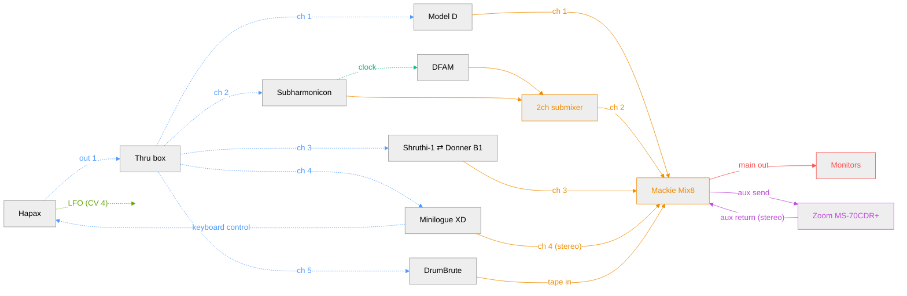

**Legend**

- MIDI (blue): dotted arrow
- Clock/sync (teal): dotted arrow
- CV (green): dotted arrow
- Audio/mixer (orange): solid arrow
- FX loop (purple): solid arrow
- Monitoring (red): solid arrow
