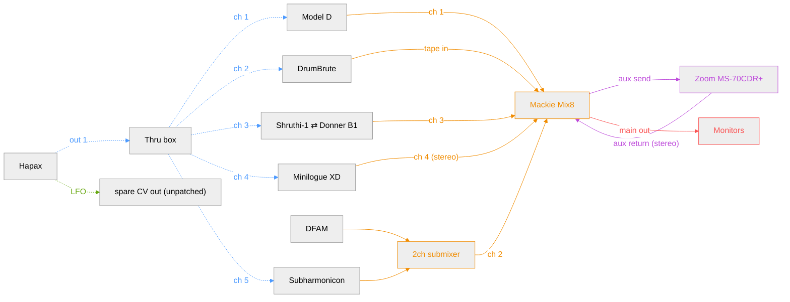

**Legend**

- MIDI (blue): dotted arrow
- CV (green): dotted arrow
- Audio/mixer (orange): solid arrow
- FX loop (purple): solid arrow
- Monitoring (red): solid arrow

## Hapax track map

Hapax has 16 tracks (any mix of MIDI or CV/Gate) and 4 physical CV/Gate pairs. All 4 pairs are currently free except the reserved spare LFO out. Proposed assignment:

| Track | Type | Destination                            | Channel / CV pair    |
|-------|------|-----------------------------------------|------------------------|
| 1     | MIDI | Model D                                  | ch 1 (via Thru box)    |
| 2     | MIDI | DrumBrute                                | ch 2 (via Thru box)    |
| 3     | MIDI | Shruthi-1 ⇄ Donner B1 (swap)              | ch 3 (via Thru box)    |
| 4     | MIDI | Minilogue XD                             | ch 4 (via Thru box)    |
| 5     | MIDI | Subharmonicon (transpose + clock)         | ch 5 (via Thru box)    |
| 6–16  | —    | free                                     | —                       |

Notes:
- Minilogue XD is bidirectional: it receives sequenced notes from Hapax on ch 4 (via the Thru box) and also sends its own keybed as a live controller directly into Hapax MIDI **in 1** — this is an input routing setting, not a separate track. *(Not drawn as an arrow above — that return link was pulling Minilogue out of the Synths column, so it's documented here in text only.)*
- Subharmonicon has no CV/Gate connection. Its MIDI in (front-panel patchbay, 3.5mm TRS Type A) now comes through the Thru box on ch 5, same as the other synths. Incoming MIDI only transposes Subharmonicon's own onboard 4-step/polyrhythmic sequencer and syncs its internal clock — it does not let Hapax dictate notes 1:1 like CV+Gate would. This preserves Subharmonicon's native semi-autonomous character.
- Subharmonicon relays clock to DFAM: its SEQ CLK output tracks its internal clock (which MIDI clock overrides), so DFAM's Clock In gets a tempo-locked signal without Hapax needing a dedicated CV/Gate cable. *(Same reason — also omitted as an arrow to keep DFAM aligned with the rest of the Synths column.)*
- DFAM currently has no active connection to Hapax for pitch — CV+Gate is deferred for now. It runs on its own onboard 8-step sequencer, clock-synced via Subharmonicon. Add a CV+Gate track (any of Hapax's 4 free pairs) whenever ready to sequence it directly from Hapax.
- Hapax MIDI usage: 1 of 4 outs (**out 1** → Thru box), 1 of 2 ins (**in 1** ← Minilogue). The rest are spare for future direct connections.
- The spare LFO CV out does **not** need its own dedicated track: automation lanes (up to 64 per track) can target any physical CV output regardless of that track's own type, so the LFO can ride on an existing track's automation rather than consuming one of the 16 track slots. Worth confirming exact behavior against the manual when reworking tracks.

## Open questions

- Exact make/model of the 2ch submixer taking DFAM + Subharmonicon before Mix8 ch 2.
