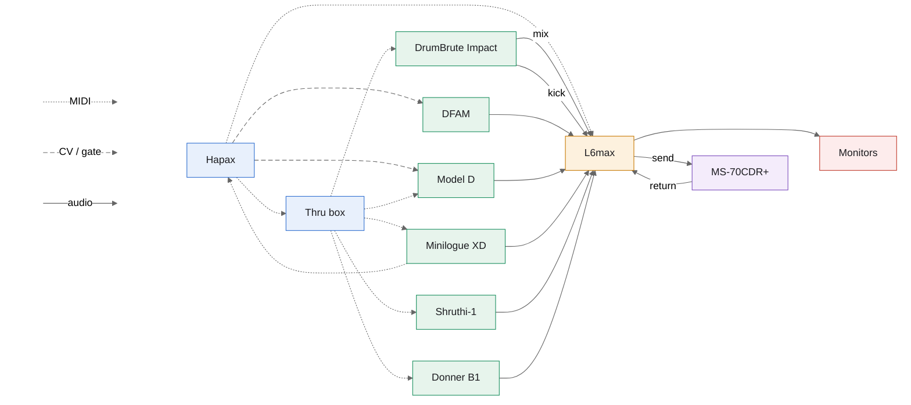

```mermaid
---
config:
  theme: neutral
  flowchart:
    curve: basis
---
flowchart LR
    %% box color = kind of gear, line style = kind of signal
    classDef seq fill:#e8f0fc,stroke:#2f6fd0,color:#1c1c20
    classDef voice fill:#e7f4ec,stroke:#1a8f5f,color:#1c1c20
    classDef mix fill:#fdf1de,stroke:#c77800,color:#1c1c20
    classDef fx fill:#f4ecfb,stroke:#7c4dbd,color:#1c1c20
    classDef mon fill:#fdecec,stroke:#c0392b,color:#1c1c20
    classDef pin fill:none,stroke:none
    classDef cv stroke-dasharray: 7 4

    %% legend, tied to Hapax by invisible links so it lands in the left columns
    LA[" "] -. "MIDI" .-> LB[" "]
    LC[" "] k1@-- "CV / gate" --> LD[" "]
    LE[" "] -- "audio" --> LF[" "]
    LB ~~~ HAPAX
    LD ~~~ HAPAX
    LF ~~~ HAPAX

    HAPAX["Hapax"]
    THRU["Thru box"]
    DBI["DrumBrute Impact"]
    DFAM["DFAM"]
    MODELD["Model D"]
    XD["Minilogue XD"]
    SHRUTHI["Shruthi-1"]
    DONNER["Donner B1"]
    L6["L6max"]
    FX["MS-70CDR+"]
    MON["Monitors"]

    %% ----- CV / gate -----
    HAPAX c1@--> DFAM
    HAPAX c2@--> MODELD

    %% ----- MIDI -----
    HAPAX -.-> THRU
    THRU -.-> DBI
    %% no signal, keeps DFAM among the voices, between DrumBrute and Model D
    THRU ~~~ DFAM
    THRU -.-> MODELD
    THRU -.-> XD
    THRU -.-> SHRUTHI
    THRU -.-> DONNER
    XD -.-> HAPAX
    HAPAX -.-> L6

    %% ----- audio -----
    DBI -- "mix" --> L6
    DBI -- "kick" --> L6
    DFAM --> L6
    MODELD --> L6
    XD --> L6
    SHRUTHI --> L6
    DONNER --> L6
    L6 -- "send" --> FX
    FX -- "return" --> L6
    L6 --> MON

    %% ----- carry no signal, they only steer the layout -----
    %% monitors out of the FX pedal's column
    FX ~~~ MON

    class HAPAX,THRU seq
    class DBI,DFAM,MODELD,SHRUTHI,DONNER,XD voice
    class L6 mix
    class FX fx
    class MON mon
    class LA,LB,LC,LD,LE,LF pin
    class c1,c2,k1 cv
```

|             | DrumBrute Impact | DrumBrute kick | DFAM               | Model D    | Minilogue XD | Shruthi-1 | Donner B1 | MS-70CDR+ |
| ----------- | ---------------- | -------------- | ------------------ | ---------- | ------------ | --------- | --------- | --------- |
| Hapax track | 1                | 1              | 3                  | 4          | 5            | 6         | 7         |           |
| L6max strip | 1                | 2              | 3                  | 4          | 5            | 6         | 7         | 8 ← aux 1 |
| MIDI ch     | 1                | 1              |                    | 4          | 5            | 6         | 7         |           |
| CV          |                  |                |                    | 1 → cutoff |              |           |           |           |
| Gate        |                  |                | 1 → ADV/CLOCK      |            |              |           |           |           |
